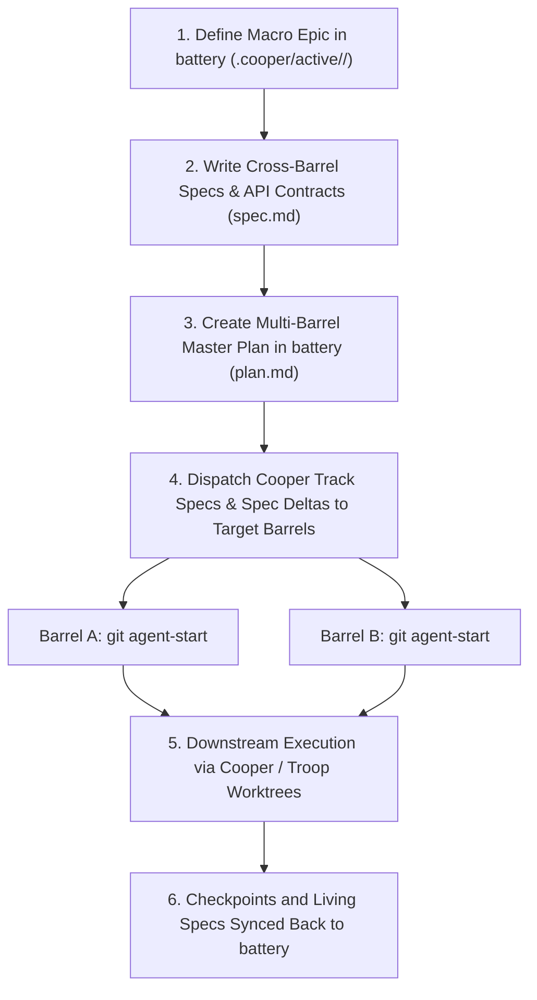

# Battery Architecture (Multi-Barrel Orchestration)

## Overview

**`battery`** is an open, agent-agnostic multi-repository Specification-Driven Development (SDD) orchestration protocol. Built on top of **[Cooper](https://github.com/twoBoots/cooper)** and **[Troop](https://github.com/twoBoots/troop)**, `battery` coordinates cross-cutting feature epics, shared interface contracts, and worktree lifecycles across a **collection of barrels** (repositories or monorepo packages) for human developers and AI agents alike.

---

## 🛢️ Core Metaphor & Ecosystem Roles

| Component | Repository | Role | Architecture & Workflow Document |
| :--- | :--- | :--- | :--- |
| **Troop** | `twoBoots/troop` | Worktree isolation & Git aliases (`.worktrees/`) | [`.cooper/TROOP.md`](TROOP.md) |
| **Cooper** | `twoBoots/cooper` | Single-repo Hybrid SDD framework (`.cooper/`) | [`.cooper/COOPER.md`](COOPER.md) |
| **Battery** | `twoBoots/battery` | Macro multi-barrel orchestrator (`.batteryrc`) | [`.cooper/BATTERY.md`](BATTERY.md) |
| **Barrels** | Target Repos/Packages | Individual services, packages, or applications | Target barrel's `.cooper/` |

---

## ⚙️ Layered Configuration (`.batteryrc` & `.batteryrc.local`)

`battery` maintains a clean separation between team defaults and local developer environments:

### 1. Canonical Team Configuration (`.batteryrc`)
Stored at the workspace root and committed to Git:
```json
{
  "$schema": "https://json-schema.org/draft/2020-12/schema",
  "version": "1.0.0",
  "structure": "multi-repo",
  "barrels": [
    {
      "name": "auth-service",
      "path": "../auth-service",
      "role": "User authentication & JWT issuer",
      "tech": "Go 1.23 / Gin",
      "jira": "AUTH"
    },
    {
      "name": "ros2-node",
      "path": "../ros2-node",
      "role": "Robotics hardware node & telemetry",
      "tech": "Rust 1.78 / ROS 2 Humble",
      "docs": "docs/barrels/ros2-node.md",
      "jira": "ROBOT"
    }
  ]
}
```

### 2. Local Developer Overrides (`.batteryrc.local`)
Stored at the workspace root and **ignored by Git** (`.gitignore`). Allows individual engineers to:
- Remap barrel paths to match custom local disk layouts
- Point to local stubs or experimental forks without polluting team commits
- Override or augment barrel metadata and environment settings

---

## 📄 Non-Cooper Barrels & Zero-Intrusion Documentation Profiles

Battery natively accommodates barrels that do **not** use Cooper (e.g. ROS 2 nodes, C/C++ firmware repositories, external vendor forks, or legacy services) with **zero modifications** required inside the target barrel repository.

### 1. Metadata in `.batteryrc`
Lightweight inline metadata can be configured directly in `.batteryrc` / `.batteryrc.local`:
- `role`: Domain role and responsibility description.
- `tech`: Primary tech stack and runtime summary.
- `docs`: Custom path to the orchestrator-level documentation profile.
- `jira`: Jira project key or issue tracker mapping.
- Arbitrary custom properties (e.g. `"lead"`, `"tier"`) are preserved automatically.

### 2. Markdown Barrel Profiles (`docs/barrels/<name>.md`)
For rich architectural documentation, Battery maintains orchestrator-level Markdown profile documents under `docs/barrels/<name>.md` with standardized sections:
1. **Role & Responsibilities**: Service boundary, domain domain rules, and upstream dependencies.
2. **Tech Stack & Runtime**: Languages, toolchains, compilers, and hardware constraints.
3. **Development & Build Commands**: Build, test, lint, and run instructions.
4. **Interface Contracts**: Exposed APIs, ROS topics/services, message formats, and protocols.
5. **AI Agent Guidelines**: Conventions, caveats, and safety protocols for autonomous agents.

### 3. Hybrid Context Resolution Hierarchy
When resolving context for a barrel across CLI commands and MCP servers:
1. **Cooper Living Spec** (`<barrel>/.cooper/definition/tech-stack.md` or `.cooper/specs/`): Highest priority if present.
2. **Battery Metadata** (`.batteryrc` `tech` & `role`): Second priority when Cooper is absent.
3. **Profile Document Highlights** (`docs/barrels/<name>.md`): Third priority, summarizing headings/lists.
4. **Default Guidance**: Clean fallback prompt to scaffold profiles or Cooper specs.

---

## 🌐 Supported Workspace Topologies

1. **Multi-Repo (`"structure": "multi-repo"`)**:
   `battery` is in its own directory, and barrels are in sibling directories (e.g. `../auth-service`, `../web-client`).
2. **Monorepo (`"structure": "monorepo"`)**:
   `battery` is at the monorepo root, and barrels are packages/subdirectories (e.g. `./packages/ui`, `./apps/web`).
3. **Custom / Hybrid (`"structure": "custom"`)**:
   Non-uniform hierarchies, polyrepos, or Git submodule directories.
4. **Hierarchical Sub-Batteries (`"type": "battery"`)**:
   A registered barrel is itself a composite battery orchestrating nested sub-barrels.

---

## 🔄 How Battery Coordinates Cooper in Downstream Barrels



### 1. Decoupled Barrel Tech Stacks
`battery` does **not** enforce a global language or runtime across barrels. Instead, `battery` reads and respects each target barrel's individual Cooper definition:
- `<barrel_path>/.cooper/definition/tech-stack.md`
Or its resolved documentation profile:
- `docs/barrels/<name>.md`

### 2. Track ID Alignment Across Repositories
- A unified `<track_id>` (e.g. `auth-flow-v2`) is authored in `battery`.
- In each participating barrel, running `git agent-start <track_id>` provisions an isolated worktree under `.worktrees/<track_id>`.
- AI agents and developers work concurrently across barrels without trunk collisions.

---

## 🤖 Root Agent Protocol & Cooper SDD Lifecycle Governance

When an AI coding assistant or human developer invokes Cooper lifecycle skills (`cooper-new-track`, `cooper-implement`, `cooper-rfc`, `cooper-review`) from the Battery root:

### 1. Non-Bypassable Spec-Driven Development (SDD)
In monorepo setups or orchestrator roots where `.cooper/index.md` is absent at `./`, agents MUST NOT bypass SDD to begin raw implementation. Agents must resolve the target barrel and enforce the full SDD artifact lifecycle (`proposal.md` -> `design.md` -> `spec-deltas/` -> `plan.md`).

### 2. Target Barrel Resolution
1. Read `.batteryrc` / `.batteryrc.local` to resolve candidate barrels.
2. Prompt or identify the target barrel (e.g. `packages/<barrel>` or sibling repository).
3. Switch execution context into the target barrel's worktree (`<barrel>/.worktrees/<track_id>`).

### 3. Track Scope & Dispatch Decision Matrix

| Scope | Mechanism | Workflow & Artifacts |
| :--- | :--- | :--- |
| **Multi-Barrel / Cross-Cutting Epic** | `battery track init` + `battery track dispatch` | 1. Initialize macro track in Battery root (`.cooper/active/<track_id>/`).<br>2. Author macro contracts, shared schemas, and initial Spec Deltas in Battery.<br>3. Dispatch track spec deltas to target barrels via `battery track dispatch <track_id>`.<br>4. Barrel agents spawn worktrees (`git agent-start <track_id>`) and autonomously author local `plan.md` + execute TDD. |
| **Single-Barrel Feature / Bug Fix** | Targeted Cooper Track (`cooper-new-track` in target barrel) | 1. Identify target barrel from `.batteryrc`.<br>2. Spawn worktree in target barrel (`<barrel>/.worktrees/<track_id>`).<br>3. Author local `proposal.md`, `design.md`, `spec-deltas/`, and TDD `plan.md`.<br>4. Execute TDD Red -> Green -> Refactor and submit barrel PR. |

---

## 💻 CLI Commands

```bash
# Workspace status and barrel connectivity (with hybrid tech/context summaries)
battery status

# List all registered barrels, metadata, roles, and profiles
battery barrel list

# Add a barrel with metadata to .batteryrc (or .batteryrc.local via --local)
battery barrel add <path> [--name <name>] [--role <role>] [--tech <tech>] [--docs <path>] [--jira <key>] [--local]

# Scaffold a starter Markdown documentation profile for a non-Cooper barrel
battery barrel doc init <name> [--force]
# (aliases: battery barrel profile init <name>)

# Remove a barrel from configuration
battery barrel remove <name_or_path> [--local]

# Reconfigure workspace structure or auto-discover barrels
battery init [--structure <multi-repo|monorepo|custom>] [--non-interactive] [-y]
```

---

## 🔌 MCP Server Resources & Tools

Battery provides Model Context Protocol (MCP) support for AI coding assistants:
- **`battery://topology`**: Merged active topology including barrel paths, roles, tech stacks, Jira mappings, and profile paths.
- **`battery://barrels/{name}/docs`**: Serves full orchestrator documentation profiles (`docs/barrels/<name>.md`).
- **`battery://barrels/{name}/tech-stack`**: Serves Cooper tech stacks with automatic fallback to barrel profiles and inline metadata.
- **`battery_list_barrels`**: Returns structured JSON barrel details with metadata and context summaries.
```
