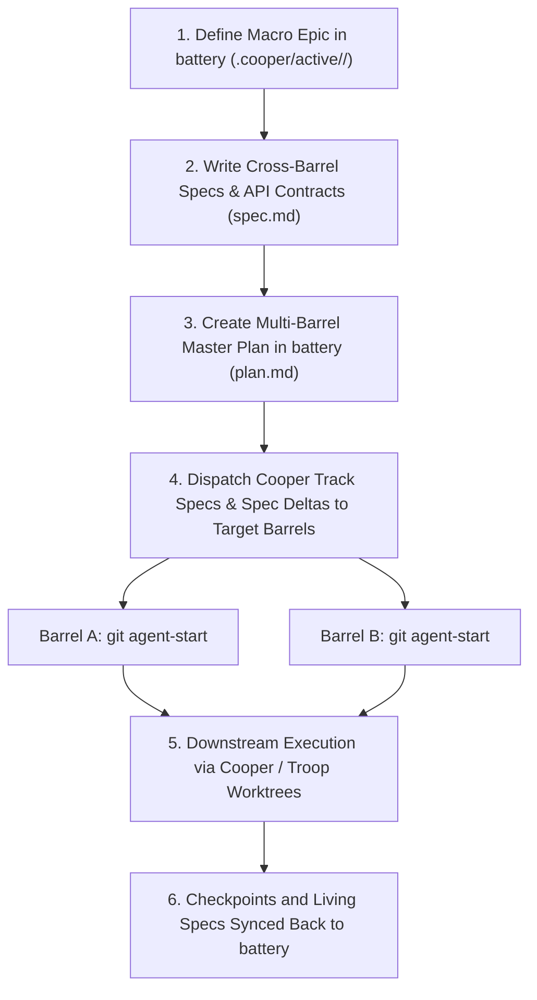

# Battery Architecture (Multi-Barrel Orchestration)

## Overview

**`battery`** is an open, agent-agnostic multi-repository Specification-Driven Development (SDD) orchestration protocol. Built on top of **[Cooper](https://github.com/twoBoots/cooper)** and **[Troop](https://github.com/twoBoots/troop)**, `battery` coordinates cross-cutting feature epics, shared interface contracts, and worktree lifecycles across a **collection of barrels** (repositories or monorepo packages) for human developers and AI agents alike.

---

## 🛢️ Core Metaphor & Ecosystem Roles

| Component | Repository | Role | Architecture & Workflow Document |
| :--- | :--- | :--- | :--- |
| **Troop** | `twoBoots/troop` | Worktree isolation & Git aliases (`.worktrees/`) | [`.cooper/TROOP.md`](TROOP.md) |
| **Cooper** | `twoBoots/cooper` | Single-repo Hybrid SDD framework (`.cooper/`) | [`.cooper/COOPER.md`](COOPER.md) |
| **Battery** | `twoBoots/battery` | Macro multi-barrel orchestrator (`.batteryrc`) | [`.cooper/BATTERY.md`](BATTERY.md) |
| **Barrels** | Target Repos/Packages | Individual services, packages, or applications | Target barrel's `.cooper/` |

---

## ⚙️ Layered Configuration (`.batteryrc` & `.batteryrc.local`)

`battery` maintains a clean separation between team defaults and local developer environments:

### 1. Canonical Team Configuration (`.batteryrc`)
Stored at the workspace root and committed to Git:
```json
{
  "$schema": "https://json-schema.org/draft/2020-12/schema",
  "version": "1.0.0",
  "structure": "multi-repo",
  "barrels": [
    { "name": "auth-service", "path": "../auth-service" },
    { "name": "web-dashboard", "path": "../web-dashboard" }
  ]
}
```

### 2. Local Developer Overrides (`.batteryrc.local`)
Stored at the workspace root and **ignored by Git** (`.gitignore`). Allows individual engineers to:
- Remap barrel paths to match custom local disk layouts
- Point to local stubs or experimental forks without polluting team commits

---

## 🌐 Supported Workspace Topologies

1. **Multi-Repo (`"structure": "multi-repo"`)**:
   `battery` is in its own directory, and barrels are in sibling directories (e.g. `../auth-service`, `../web-client`).
2. **Monorepo (`"structure": "monorepo"`)**:
   `battery` is at the monorepo root, and barrels are packages/subdirectories (e.g. `./packages/ui`, `./apps/web`).
3. **Custom / Hybrid (`"structure": "custom"`)**:
   Non-uniform hierarchies, polyrepos, or Git submodule directories.
4. **Hierarchical Sub-Batteries (`"type": "battery"`)**:
   A registered barrel is itself a composite battery orchestrating nested sub-barrels.

---

## 🔄 How Battery Coordinates Cooper in Downstream Barrels



### 1. Decoupled Barrel Tech Stacks
`battery` does **not** enforce a global language or runtime across barrels. Instead, `battery` reads and respects each target barrel's individual Cooper definition:
- `<barrel_path>/.cooper/definition/tech-stack.md`

### 2. Track ID Alignment Across Repositories
- A unified `<track_id>` (e.g. `auth-flow-v2`) is authored in `battery`.
- In each participating barrel, running `git agent-start <track_id>` provisions an isolated worktree under `.worktrees/<track_id>`.
- AI agents and developers work concurrently across barrels without trunk collisions.

---

## 💻 CLI Commands

```bash
# Workspace status and barrel connectivity
battery status

# List all registered barrels and resolved Cooper tech stacks
battery barrel list

# Add a barrel to .batteryrc (or .batteryrc.local via --local)
battery barrel add <path> [--name <name>] [--type <barrel|battery>] [--local]

# Remove a barrel from configuration
battery barrel remove <name_or_path> [--local]

# Reconfigure workspace structure or auto-discover barrels
battery init [--structure <multi-repo|monorepo|custom>] [--non-interactive] [-y]
```
