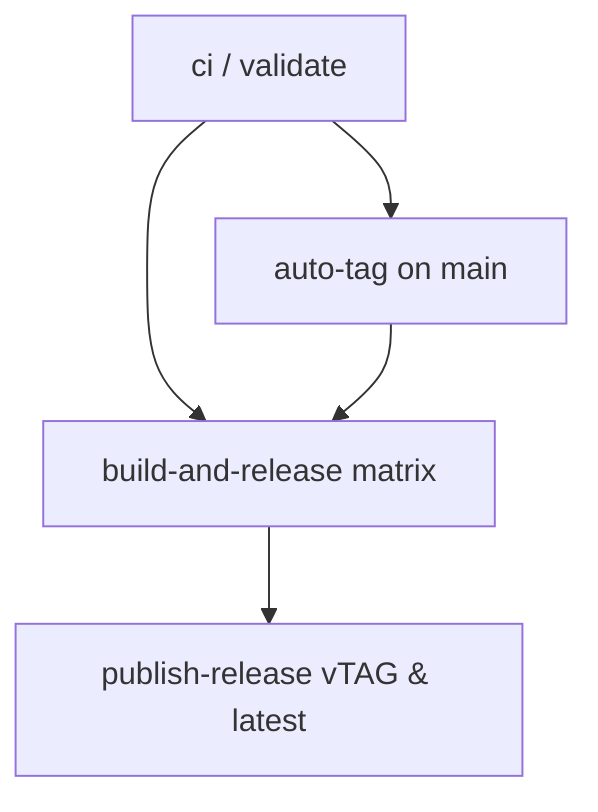

# Design: Battery Auto-Tag Release Pipeline

## Overview
Port the standardized `auto-tag` pattern from `twoBoots/bender` into `battery/.github/workflows/release.yml`. When a PR with a bumped `Version` in `cmd/root.go` is merged into `main`, GitHub Actions automatically:
1. Validates CI tests and lints.
2. Checks if Git tag `v<Version>` exists on `origin`.
3. Creates and pushes `v<Version>` if missing.
4. Compiles cross-platform binaries across 5 matrix targets (`linux/amd64`, `linux/arm64`, `darwin/amd64`, `darwin/arm64`, `windows/amd64`).
5. Publishes release assets under both the semantic version tag `v<Version>` and `latest`.

## GitHub Actions Workflow Architecture

### 1. `auto-tag` Job
- Runs if `github.ref == 'refs/heads/main'`.
- Extracts `VERSION` from `cmd/root.go`.
- Checks `git ls-remote --tags origin refs/tags/v${VERSION}`.
- If not present, creates and pushes `v${VERSION}` using `github-actions[bot]`.

### 2. `build-and-release` Job
- Depends on `[ci, auto-tag]`.
- Uses condition: `if: always() && needs.ci.result == 'success' && (needs.auto-tag.result == 'success' || needs.auto-tag.result == 'skipped')`.
- Compiles matrix targets with `actions/checkout@v6` and `actions/setup-go@v6`.

### 3. `publish-release` Job
- Downloads artifacts with `actions/download-artifact@v8`.
- Publishes/updates GitHub Release for `v<Version>` (`gh release create` / `gh release upload --clobber`).
- Publishes/updates GitHub Release for `latest` (`gh release create` / `gh release upload --clobber`).
