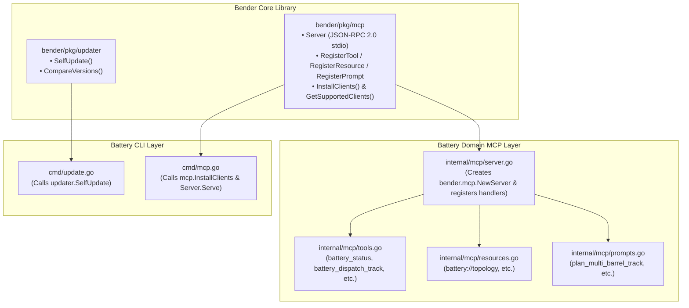

# Design: Battery Bender CLI Integration

## Architectural Overview

`battery` transitions from maintaining internal updater and MCP protocol engines to importing them directly from `github.com/twoBoots/bender`.



## Component Breakdown

### 1. `cmd/update.go`
- Refactored to delegate directly to `updater.SelfUpdate`:
  ```go
  opts := updater.Options{
      Repo:           "twoBoots/battery",
      BinaryName:     "battery",
      CurrentVersion: Version,
      TargetVersion:  targetVersion,
      Force:          force,
      CheckOnly:      checkOnly,
  }
  res, err := updater.SelfUpdate(opts)
  ```
- Flags preserved: `--check` (`-c`), `--force` (`-f`), `--target-version` (`-t`).

### 2. `internal/mcp/` Refactoring
- **Deleted redundant protocol/installer files**:
  - `internal/mcp/protocol.go` & `protocol_test.go`
  - `internal/mcp/installer.go` & `installer_test.go`
- **Updated `internal/mcp/server.go`**:
  - Initializes `srv := mcp.NewServer("battery-mcp", version, cwd)`.
  - Re-registers Battery domain tools, resources, and prompts using Bender's `Tool`, `Resource`, `Prompt`, and handler interfaces.
- **Updated `cmd/mcp.go`**:
  - Server execution: Starts `internal/mcp.NewServer()` and serves over `os.Stdin` / `os.Stdout`.
  - Client installation: Uses `mcp.InstallClients()` and `mcp.GetSupportedClients()`.

### 3. Cleanup & Deletion of `internal/updater/`
- Remove `internal/updater/platform.go`, `release.go`, `semver.go`, `updater.go`, and their corresponding test files.

## Testing & Quality Strategy
- Update CLI unit tests in `cmd/update_test.go` and `cmd/mcp_test.go` to mock or verify interactions with Bender library functions.
- Update `internal/mcp/*_test.go` to verify tool, resource, and prompt registrations and execution through Bender's server.
- Run `go test -v -coverprofile=coverage.out ./...` to ensure coverage exceeds 80%.
