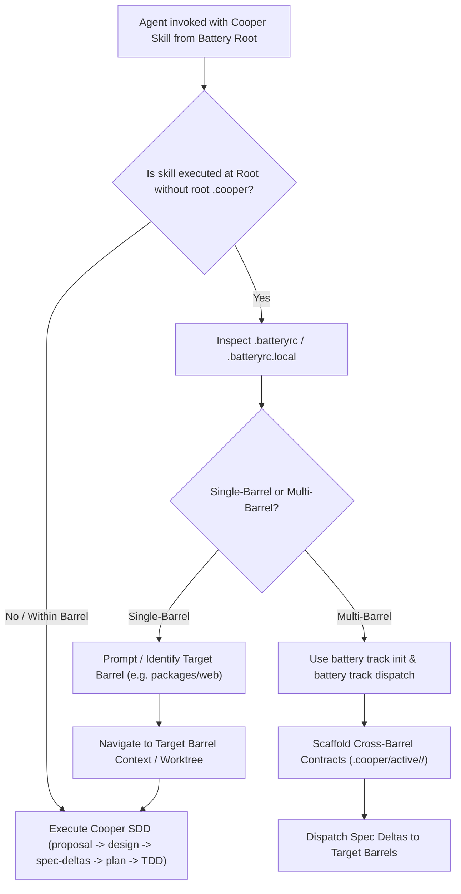

# Technical Design: Battery Root AGENTS.md Protocol & Cooper SDD Lifecycle Governance

## Architectural Overview

In a Battery multi-barrel ecosystem, `AGENTS.md` acts as the root contract between AI agents, developers, and the project toolchain.

## Section Structure for `AGENTS.template.md` & `AGENTS.md`

`AGENTS.template.md` and `AGENTS.md` must be unified with the following comprehensive structure:

1. **Battery Agent Rules (Multi-Barrel Orchestrator)**:
   - Isolation Protocol (`.worktrees/<track_id>`)
   - Branching Strategy
   - Execution & Cleanup (`git agent-start` / `git agent-stop`)
   - Configuration & Topology (`.batteryrc`, `.batteryrc.local`)
   - Spec-Only Orchestrator Boundary
2. **Battery Root Runtime Protocol for Cooper Skills (CRITICAL)**:
   - Non-Bypassable SDD Rule: Never skip SDD or write unspecced code when Cooper is uninitialized at root.
   - Barrel Resolution Protocol: Read `.batteryrc`, identify target barrel, operate within target barrel context.
   - Track Scope Decision Matrix: Multi-Barrel (`battery track init` / `battery track dispatch`) vs Single-Barrel (`cooper-new-track` inside `<barrel>`).
3. **Agent Guidelines (Cooper SDD Framework + Troop Workflow)**:
   - Cooper Framework Mandate (`.cooper/`)
   - Troop Worktree Isolation Protocol
   - Phase & Remote Synchronization
   - Quality & Execution Control (Strict TDD, test coverage >80%, Git Notes)
   - Project-Local Skills Reference

## Template Integration & Consistency

- `AGENTS.template.md`: Used by `install.sh` and CLI scaffolding to initialize or prepend agent rules to new and existing repositories.
- `AGENTS.md`: The active root rules file in the Battery repository itself.
- `internal/framework/templates/docs/BATTERY.md` and `.cooper/BATTERY.md`: Updated to document the root agent guidelines and decision flow.
