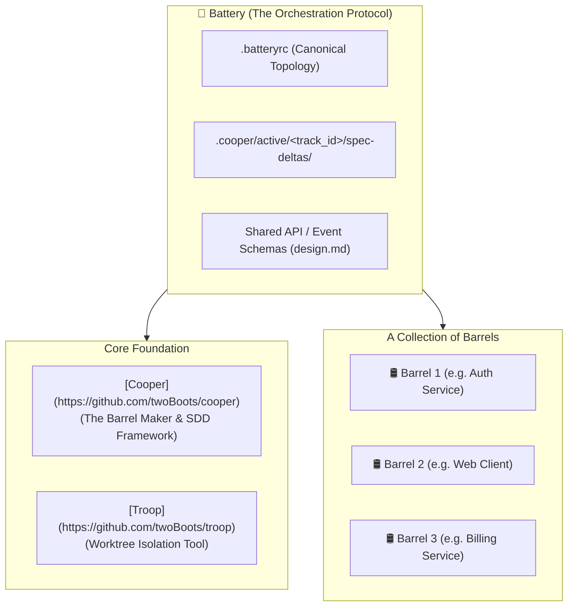

# Battery Architecture & Topology 🏛️

**Battery** is an open, agent-agnostic and repository-agnostic multi-repository Specification-Driven Development (SDD) orchestration protocol. It coordinates multi-repository tracks, contracts, and living capability specs across a collection of independent repositories or monorepo packages (termed **barrels**).

---

## 🛢️ Core Metaphor



* **[Cooper](https://github.com/twoBoots/cooper)**: The barrel maker managing SDD specifications (`.cooper/`) and worktree lifecycle for human developers and autonomous AI agents.
* **[Troop](https://github.com/twoBoots/troop)**: Worktree isolation tool providing shared Git aliases for human developers and AI code monkeys working in isolated worktrees (`.worktrees/`).
* **Barrel**: An individual repository, package, or microservice within the system landscape.
* **Battery**: A collection of barrels orchestrated together for cross-repository feature epics.

---

## ⚙️ Layered Configuration (`.batteryrc` & `.batteryrc.local`)

Battery adopts a two-layer configuration model:
1. **`.batteryrc` (Canonical Topology)**: Committed to version control, defining standard team barrels, relative paths, and workspace structure.
2. **`.batteryrc.local` (Local Overrides)**: Git-ignored file allowing individual developers to override barrel paths to match local filesystem directories.

### Example `.batteryrc`
```json
{
  "$schema": "https://json-schema.org/draft/2020-12/schema",
  "version": "1.0.0",
  "structure": "multi-repo",
  "barrels": [
    {
      "name": "auth-service",
      "path": "../auth-service"
    },
    {
      "name": "web-dashboard",
      "path": "../web-dashboard"
    }
  ]
}
```

---

## 🗺️ Supported Topologies

Battery supports multiple workspace structures out of the box:

### 1. Multi-Repo (`"structure": "multi-repo"`)
Barrels reside as sibling repositories on the filesystem:
```
workspace/
├── battery/           # Orchestrator root
├── auth-service/      # Barrel 1
└── web-dashboard/     # Barrel 2
```

### 2. Monorepo (`"structure": "monorepo"`)
Barrels reside as packages inside subdirectories within a single repository:
```
monorepo-root/
├── .batteryrc
├── packages/
│   ├── auth/          # Barrel 1
│   └── ui/            # Barrel 2
└── apps/
    └── web/           # Barrel 3
```

### 3. Custom (`"structure": "custom"`)
Hybrid layouts, distributed disk paths, or Git submodules.

### 4. Hierarchical Sub-Batteries (`"type": "battery"`)
A barrel can itself be a composite battery orchestrating nested sub-barrels, allowing scalable organizational hierarchies.

---

## 🛠️ Decoupled Barrel Tech Stacks

Battery intentionally avoids centralizing tech stack definitions. Instead, Battery dynamically resolves each barrel's local [Cooper](https://github.com/twoBoots/cooper) definition:
```
<barrel_path>/.cooper/definition/tech-stack.md
```

Each barrel maintains complete autonomy:
* **Backend Barrel**: Go, Postgres, Docker, GitHub Actions, `golangci-lint`.
* **Frontend Barrel**: TypeScript, React, Vite, Vitest, ESLint.

When Battery dispatches track requirements, barrel agents inspect their own local tech stack and author TDD tasks matching their specific language idioms.

---

## 📐 Decoupled Planning Boundary

| Level | Scope | Responsibility | Key Artifacts |
| :--- | :--- | :--- | :--- |
| **Battery Orchestrator** | Cross-Barrel (Macro) | Defines **WHAT** & **WHY**: system-level requirements, OpenAPI schemas, shared protobufs, spec deltas | `proposal.md`, `design.md`, `spec-deltas/` |
| **Target Barrels** | Single Barrel (Local) | Defines **HOW**: internal component architecture, database migrations, TDD task breakdown | `.worktrees/<track_id>/.cooper/active/<track_id>/plan.md` |

By isolating local implementation plans to barrel worktrees managed by [Troop](https://github.com/twoBoots/troop), Battery prevents AI agent hallucinations and context window overflow.

---

## 🔗 Related Resources

* [Getting Started Guide](guide/getting-started.md)
* [Multi-Barrel Workflow Guide](guide/workflow.md)
* [Model Context Protocol (MCP) Server](mcp.md)
* [Installation Guide](installation.md)
* [Cooper SDD Framework](https://github.com/twoBoots/cooper)
* [Troop Worktree Isolation](https://github.com/twoBoots/troop)

