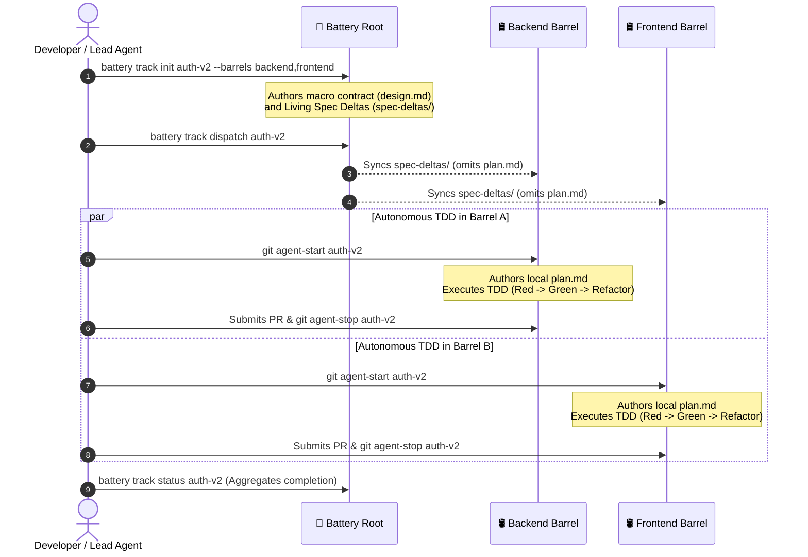

# Multi-Barrel Track Lifecycle Workflow 🔄

Battery provides a structured, contract-first orchestration lifecycle for feature epics spanning multiple repositories or monorepo packages (barrels). By combining **[Cooper](https://github.com/twoBoots/cooper)** for Spec-Driven Development (SDD) and **[Troop](https://github.com/twoBoots/troop)** for Git worktree isolation, Battery ensures cross-barrel consistency without sacrificing repository autonomy.

---

## 🧭 The Multi-Barrel Lifecycle



---

## 1. Track Initialization

To initiate a cross-cutting epic across barrels:

```bash
battery track init <track_id> --barrels <barrel-1>,<barrel-2> --name "Feature Title"
```

This scaffolds a dedicated track directory at the Battery root:
* `.cooper/active/<track_id>/metadata.json`: Stores participating barrels, status, and metadata.
* `.cooper/active/<track_id>/proposal.md`: Defines high-level business goals, requirements, and scope boundaries.
* `.cooper/active/<track_id>/design.md`: Specifies shared contracts (REST endpoints, protobuf schemas, events).
* `.cooper/active/<track_id>/spec-deltas/`: Scaffolds living specification additions (`+`) and removals (`-`).

---

## 2. Decoupled Planning Protocol

> [!IMPORTANT]
> **Orchestrator Boundary Rule**: When operating from the Battery multi-barrel root, agents and developers author macro contracts and spec deltas. The Battery root **MUST NOT** author barrel-internal `plan.md` files or write target barrel code directly.

Local implementation planning is intentionally delegated to autonomous sessions running inside each target barrel. This guarantees:
1. **Context Window Optimization**: Barrel agents only need context on their own repository codebase.
2. **Tech Stack Autonomy**: Each barrel uses its own idioms, test runners, and styleguides defined in `.cooper/definition/tech-stack.md`.
3. **Collision Avoidance**: Barrel agents create their own TDD checklists without conflicting with cross-repo plans.

---

## 3. Spec Dispatch

Once contracts and spec deltas are ready, dispatch the track into participating barrels:

```bash
battery track dispatch <track_id>
```

Battery synchronizes the track artifacts and spec deltas to each barrel's `.cooper/active/<track_id>/` directory while strictly omitting `plan.md` to preserve local planning autonomy.

---

## 4. Worktree Isolation with [Troop](https://github.com/twoBoots/troop)

Inside each target barrel, developers or agents spawn an isolated worktree based off `main`:

```bash
# Navigate to target barrel
cd ../backend

# Spawn isolated worktree off main
git agent-start <track_id>
```

This ensures feature implementation is completely isolated from the main trunk in `.worktrees/<track_id>`.

---

## 5. Autonomous TDD Implementation

Within the isolated barrel worktree:
1. Ground implementation in living capability specs using [Cooper](https://github.com/twoBoots/cooper) SDD.
2. Author local `plan.md` with granular TDD tasks.
3. Follow the strict **Red -> Green -> Refactor** cycle:
   * **Red**: Write failing unit or integration tests.
   * **Green**: Write minimal code to pass tests.
   * **Refactor**: Optimize code, verify styleguides, ensure >80% test coverage.
4. Record Git Notes metadata on commits:
   ```bash
   git notes add -m "Task: <task_name>\nScope: <files>\nSummary: <details>" <commit_sha>
   ```

---

## 6. Centralized Status Aggregation

From the Battery root, track status across all participating barrels can be aggregated in real time:

```bash
# Check status of specific multi-barrel track
battery track status <track_id>

# List all active and completed tracks
battery track list
```

Battery parses each barrel's local `plan.md` and phase checkpoints to display overall multi-repo progress.

---

## 7. Review, Merge & Teardown

1. Submit pull requests in each target barrel repository.
2. After PR merge, cleanly tear down the isolated worktree:
   ```bash
   git agent-stop <track_id>
   ```
3. Mark the multi-barrel track complete in Battery:
   ```bash
   battery track status <track_id>
   ```

---

## 🔗 Related Resources

* [Getting Started Guide](getting-started.md)
* [Architecture & Topology Model](../architecture.md)
* [Model Context Protocol (MCP) Server](../mcp.md)
* [Installation Guide](../installation.md)
* [Cooper Framework](https://github.com/twoBoots/cooper)
* [Troop Isolation Tool](https://github.com/twoBoots/troop)

