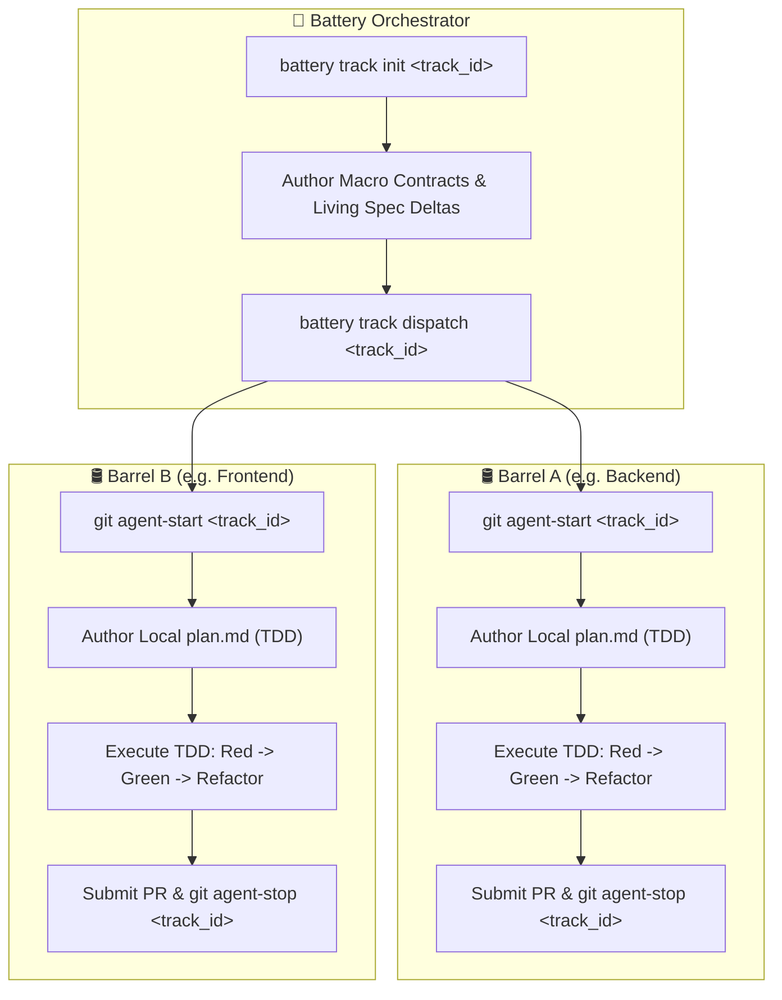

## 🚀 Quickstart Installation

Install Battery into your workspace with a single command:

```bash
curl -fsSL https://raw.githubusercontent.com/twoBoots/battery/main/install.sh | bash
```

The installer verifies your environment, sets up [Troop](https://github.com/twoBoots/troop) Git aliases, scaffolds the [Cooper](https://github.com/twoBoots/cooper) SDD infrastructure, installs the `battery` CLI binary, and guides you through initial `.batteryrc` workspace topology discovery.

---

## 🔄 Multi-Barrel Lifecycle Workflow

Battery orchestrates cross-repository features while preserving repository autonomy through a contract-first lifecycle:



Read the full [Getting Started Guide](guide/getting-started.md) or explore the [Workflow Guide](guide/workflow.md) for in-depth guidance.

