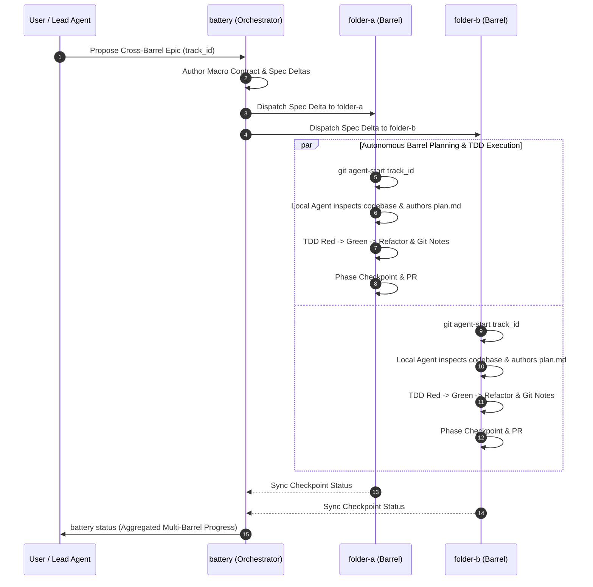

# Multi-Barrel Track Dispatch & Decoupled Planning Architecture

## Overview

**Battery** orchestrates cross-cutting feature epics across multiple independent repositories or monorepo packages (termed **barrels**). This document describes the **Contract-First Decoupled Planning Architecture**, establishing why Battery authors macro interface contracts and requirements while delegating localized technical design and TDD task breakdown (`plan.md`) to autonomous agents inside each target barrel.

---

## 🏛️ Core Principles

### 1. Separation of "What" vs. "How"
* **Battery (The Orchestrator) defines the *WHAT* & *WHY*:** System-level business intent, acceptance criteria, cross-barrel interface contracts (OpenAPI/REST, gRPC, event schemas), and living Spec Deltas (`spec-deltas/`).
* **The Barrel Agent defines the *HOW*:** Local technical architecture (`design.md`), internal component/handler structure, database queries/migrations, test doubles, and granular TDD task checklists (`plan.md`).

### 2. Context Window Optimization
AI agents working inside a specific barrel (e.g. `folder-a` backend or `folder-b` frontend) only need deep context on their own repository's code, dependencies, and test suite. Keeping planning localized prevents context pollution, hallucinations about foreign file paths, and cross-repo coordination bottlenecks.

### 3. Tech Stack Autonomy
Each barrel defines its own language, frameworks, and linting rules in its local `.cooper/definition/tech-stack.md` and `.cooper/code_styleguides/`. Local agents plan and execute according to their repository's idioms (e.g. Go table tests vs. Vitest/MSW).

---

## 🗂️ Artifact Hierarchy Across Barrels

When a cross-cutting feature (e.g. `track_id = "user-profile-v2"`) is orchestrated across sibling barrels `folder-a` and `folder-b`:

```
┌────────────────────────────────────────────────────────┐
│               battery (The Orchestrator)               │
│  .cooper/active/user-profile-v2/                       │
│  ├── metadata.json       (Target barrels: a & b)       │
│  ├── proposal.md         (Macro epic intent)           │
│  ├── design.md           (Shared API & contract specs) │
│  └── plan.md             (Macro milestone gates)       │
└──────────────────────────┬─────────────────────────────┘
                           │ Dispatches Track Spec Deltas
            ┌──────────────┴──────────────┐
            ▼                             ▼
┌───────────────────────────┐ ┌───────────────────────────┐
│ folder-a (Backend Barrel) │ │folder-b (Frontend Barrel) │
│ .worktrees/user-profile-v2│ │.worktrees/user-profile-v2 │
│ └── .cooper/active/...    │ │ └── .cooper/active/...    │
│     ├── proposal.md       │ │     ├── proposal.md       │
│     ├── design.md         │ │     ├── design.md         │
│     ├── spec-deltas/      │ │     ├── spec-deltas/      │
│     └── plan.md (TDD)     │ │     └── plan.md (TDD)     │
└───────────────────────────┘ └───────────────────────────┘
```

### 1. Macro Orchestrator Level (`battery`)

Stored in `battery/.cooper/active/<track_id>/`:
* **`metadata.json`**: Track ID, status, timestamps, and list of participating barrels (`["folder-a", "folder-b"]`).
* **`proposal.md`**: Macro epic summary explaining business rationale, scope, and cross-barrel boundaries.
* **`design.md`**: Interface contract specifications (HTTP routes, payloads, gRPC protos, async event payloads).
* **`plan.md`**: Cross-repo milestone roadmap (e.g. *Gate 1: folder-a publishes API schema -> Gate 2: folder-b integrates client*).

### 2. Target Barrel Level (`folder-a` & `folder-b`)

Created inside `.worktrees/<track_id>/.cooper/active/<track_id>/` via `git agent-start <track_id>`:
* **`metadata.json`**: Barrel-level track metadata referencing the upstream Battery track ID.
* **`proposal.md`**: Localized summary of this barrel's specific contribution.
* **`design.md`**: Barrel-specific technical architecture tailored to its tech stack.
* **`spec-deltas/<capability>/spec.md`**: Requirement diffs using `+` (additions) and `-` (removals) in GIVEN/WHEN/THEN format against the barrel's living specs.
* **`plan.md`**: Step-by-step TDD task checklist with Red-Green-Refactor phases, test coverage gates (>80%), and phase checkpoints.

---

## 🔄 End-to-End Track Lifecycle



### Step 1: Macro Epic Proposal in Battery
Battery defines the track and writes the shared contract specification.

### Step 2: Spec Dispatch to Target Barrels
Battery writes the initial track metadata and `spec-deltas/` into target barrels.

### Step 3: Localized Planning by Barrel Agents
Agents inside each barrel run `git agent-start <track_id>`, inspect their local codebase and living capability specs, and construct their own executable `plan.md`.

### Step 4: TDD Execution & Checkpoints
Barrels execute their local TDD loops independently. At phase completion:
1. Run local test suite (`CI=true`).
2. Commit with Git Notes (`git notes add -m "<summary>" <hash>`).
3. Push checkpoint branch (`git push origin <track_id>`).

### Step 5: Merge, Living Spec Integration & Teardown
When each barrel PR merges:
1. Spec Deltas are merged into `.cooper/specs/<capability>/spec.md`.
2. Active track moves to `.cooper/archive/<track_id>/`.
3. Worktree canopy is cleaned up with `git agent-stop <track_id>`.

---

## 💻 CLI Command Vision

```bash
# Initialize and dispatch a new cross-barrel track spec
battery track init <track_id> --barrels folder-a,folder-b

# Inspect multi-barrel progress across all participating worktrees
battery track status [<track_id>]

# Validate contract alignment between barrel spec deltas
battery track verify <track_id>
```
